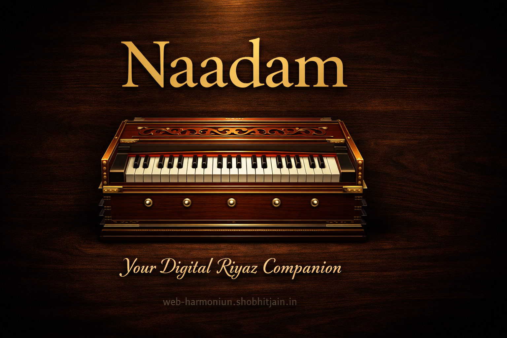

# Naadam — Free Online Harmonium



**Naadam** is a premium web-based harmonium application designed for Indian classical music practice and riyaz. Play Sa Re Ga Ma Pa Dha Ni directly in your browser with authentic harmonium sounds, Sargam notation, raga support, and practice tools.

🌐 **Live Demo:** [web-harmonium.shobhitjain.in](https://web-harmonium.shobhitjain.in)

---

## ✨ Features

### 🎹 Virtual Harmonium
- **Realistic harmonium sound** using Web Audio API sample-based synthesis
- **Keyboard & mouse support** — Play with QWERTY keyboard or click/touch
- **Multiple reeds** — Simulate traditional harmonium octave coupling
- **Sustain pedal** — Hold spacebar for continuous notes
- **Transpose & octave control** — Adjust pitch without changing Sargam

### 🎵 Indian Classical Music Tools
- **Sargam notation tracker** — See played notes in real-time (Sa Re Ga Ma...)
- **Raga highlighter** — Highlights scale notes for 10+ ragas (Yaman, Bhairav, Kafi, etc.)
- **Alankar patterns** — Auto-play practice exercises (Aroha, Avroha, Zig-Zag)
- **Metronome with Taal presets** — Teentaal, Keherwa, Jhaptaal, Rupak, Dadra

### 🎚️ Audio Controls
- **Volume control** with persistence
- **Reverb effect** — Convolution reverb for authentic sound
- **MIDI input support** — Connect external MIDI keyboards

### 📱 Responsive Design
- Works on desktop, tablet, and mobile
- Touch-optimized keyboard
- Beautiful glass morphism UI with warm Indian aesthetic

---

## 🚀 Quick Start

### Prerequisites
- Node.js 18+ or Bun
- Modern browser (Chrome/Edge recommended for MIDI support)

### Installation

```bash
# Clone the repository
git clone https://github.com/yourusername/harmonium-haven.git
cd harmonium-haven

# Install dependencies
npm install

# Start development server
npm run dev
```

Visit http://localhost:8080 to see the app running.

---

## 📦 Available Scripts

```bash
# Development
npm run dev          # Start dev server on http://localhost:8080

# Building
npm run build        # Production build
npm run build:dev    # Development build with source maps
npm run preview      # Preview production build

# Code Quality
npm run lint         # Lint code with ESLint

# Testing
npm run test         # Run all tests
npm run test:watch   # Run tests in watch mode
```

---

## 🎹 Keyboard Shortcuts

### Playing Notes
| Key | Note | Sargam |
|-----|------|--------|
| Tab | G | — |
| Q   | G#| — |
| W   | A | — |
| E   | A#| **Sa** |
| R   | B | **Re** |
| T   | C | **Ga** |
| Y   | C#| **Ma** |
| U   | D | **Pa** |
| I   | D#| **Dha** |
| O   | E | **Ni** |
| P   | F | — |
| [   | F#| — |
| ]   | G | — |

**Black keys (sharps/flats):** 1, 2, 4, 5, 7, 8, 9, -, =

### Controls
- **Spacebar** — Sustain pedal (hold notes)

---

## 🏗️ Technology Stack

- **Frontend:** React 18 + TypeScript
- **Build Tool:** Vite
- **UI Components:** shadcn/ui (Radix UI + Tailwind CSS)
- **Audio:** Web Audio API
- **Routing:** React Router
- **State Management:** React hooks + localStorage
- **Testing:** Vitest + Testing Library + Playwright
- **Styling:** Tailwind CSS with custom Indian-inspired theme

---

## 🎨 Architecture

### Audio Engine
The core audio system (`useHarmoniumAudio` hook) uses:
- **Sample-based synthesis** — Loads harmonium sample and pitch-shifts using `detune`
- **Convolution reverb** — Authentic hall reverb with dry/wet mixing
- **Multiple reed simulation** — Layers octaves for traditional harmonium sound
- **Sustain pedal** — Mimics foot pedal behavior

### Component Structure
```
src/
├── components/
│   ├── HarmoniumKeyboard.tsx    # Main keyboard UI & input
│   ├── ControlsPanel.tsx        # Volume, reverb, transpose
│   ├── NotationTracker.tsx      # Sargam notation display
│   ├── Metronome.tsx            # Metronome with Taal presets
│   ├── RagaSelector.tsx         # Raga highlighter
│   ├── AlankarMode.tsx          # Practice patterns
│   ├── MidiInput.tsx            # MIDI device support
│   └── ui/                      # shadcn/ui components
├── hooks/
│   └── useHarmoniumAudio.ts     # Audio engine hook
├── lib/
│   ├── constants.ts             # Music theory data (ragas, taals, etc.)
│   └── utils.ts                 # Utility functions
└── pages/
    └── Index.tsx                # Main app page
```

---

## 🌍 Deployment

### Build for Production
```bash
npm run build
```

The `dist/` folder contains the production-ready app. Deploy to:
- **Vercel** — `vercel deploy`
- **Netlify** — `netlify deploy`
- **GitHub Pages** — Push `dist/` to `gh-pages` branch
- **Any static host** — Upload `dist/` contents

### Environment Variables
No environment variables required. Audio samples are included in the repository.

---

## 🎯 Roadmap

- [ ] Recording & playback
- [ ] More ragas (expand from current 10)
- [ ] Tabla accompaniment sounds
- [ ] Custom scale builder
- [ ] Share compositions via URL
- [ ] PWA support (offline mode)
- [ ] Tanpura drone background

---

## 🤝 Contributing

Contributions are welcome! Please:
1. Fork the repository
2. Create a feature branch (`git checkout -b feature/amazing-feature`)
3. Commit your changes (`git commit -m 'Add amazing feature'`)
4. Push to the branch (`git push origin feature/amazing-feature`)
5. Open a Pull Request

---

## 📄 License

This project is open source and available under the MIT License.

---

## 👨‍💻 Author

**Shobhit Jain**
- LinkedIn: [linkedin.com/in/shobhitjain09](https://www.linkedin.com/in/shobhitjain09/)
- Website: [web-harmonium.shobhitjain.in](https://web-harmonium.shobhitjain.in)

---

## 🙏 Acknowledgments

- Audio samples sourced from open-source harmonium recordings
- Inspired by the need for accessible Indian classical music practice tools
- Built with modern web technologies to make riyaz available anywhere

---

**Made with ❤️ for Indian classical music practitioners worldwide**
